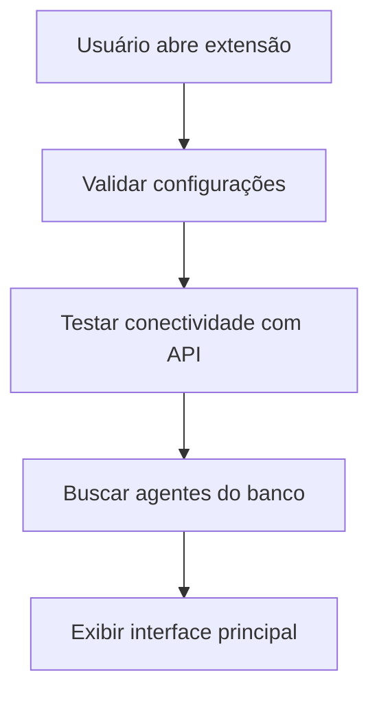
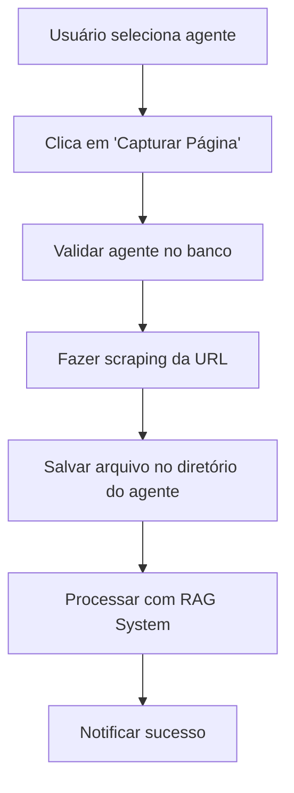

# 🔌 Extensão Chrome Isolada - RAG Python

## 📋 Visão Geral

A extensão do Chrome foi **completamente isolada** do sistema principal de agentes, criando uma arquitetura limpa e segura que:

- ✅ **Não interfere** no funcionamento dos agentes principais
- ✅ **Integra diretamente** com o banco de dados para buscar agentes
- ✅ **Mantém isolamento** de segurança entre agentes
- ✅ **Processa conteúdo web** de forma independente

## 🏗️ Arquitetura Isolada

```
┌─────────────────────────────────────────────────────────────────┐
│                    SISTEMA RAG PYTHON                          │
├─────────────────────────────────────────────────────────────────┤
│                                                                 │
│  🏢 SISTEMA PRINCIPAL          🔌 EXTENSÃO CHROME (ISOLADA)     │
│  ├── 🤖 Agentes RAG            ├── 📄 Captura de Páginas       │
│  ├── 💾 Upload de Arquivos     ├── 🔍 Busca de Agentes         │
│  ├── 💬 Chat Interface         ├── ✅ Validação de Agentes     │
│  └── 📊 Dashboard              └── 🌐 Processamento Web        │
│                                                                 │
├─────────────────────────────────────────────────────────────────┤
│                    CAMADA DE INTEGRAÇÃO                        │
│                                                                 │
│  📊 BANCO DE DADOS POSTGRESQL                                   │
│  ├── 🔒 Isolamento por agent_id                               │
│  ├── 👥 Tabela de agentes compartilhada                       │
│  ├── 📄 Documentos isolados por agente                        │
│  └── 🧩 Vector embeddings isolados                            │
│                                                                 │
└─────────────────────────────────────────────────────────────────┘
```

## 🔧 Componentes da Extensão Isolada

### 1. **ChromeExtensionManager** (`chrome_extension_manager.py`)
Gerenciador principal responsável por toda a lógica da extensão:

```python
class ChromeExtensionManager:
    def get_agents_from_db(self)          # Busca agentes diretamente do banco
    def validate_agent_exists(self)       # Valida agente específico
    def process_url_content(self)         # Processa conteúdo web capturado
```

### 2. **API Isolada** (`/api/v1/extension/`)
Endpoints específicos para a extensão:

- `GET /api/v1/extension/health` - Health check da API
- `GET /api/v1/extension/agents` - Lista agentes ativos
- `POST /api/v1/extension/capture_page` - Captura página web
- `GET /api/v1/extension/agent/<id>/validate` - Valida agente

### 3. **Interface da Extensão** (`scraper_extension/`)
Interface atualizada com melhor UX:

- **popup.html** - Interface moderna com Bootstrap
- **popup.js** - Lógica atualizada para nova API
- **manifest.json** - Configuração da extensão

## 🔄 Fluxo de Funcionamento

### 1. **Inicialização da Extensão**


### 2. **Captura de Página**


## 📊 Integração com Banco de Dados

### **Busca de Agentes**
```sql
SELECT id, nome, descricao, status 
FROM agentes 
WHERE status = 'ativo'
ORDER BY nome
```

### **Validação de Agente**
```sql
SELECT id, nome, status 
FROM agentes 
WHERE id = %s AND status = 'ativo'
```

### **Isolamento Garantido**
- Cada página capturada é salva no diretório específico do agente: `agent_uploads/{agent_id}/`
- O processamento RAG mantém isolamento por `agent_id`
- Validações múltiplas garantem que apenas agentes ativos sejam utilizados

## 🔒 Segurança e Isolamento

### **Validações Implementadas**
1. **Agent ID obrigatório** em todas as operações
2. **Status 'ativo'** verificado antes de qualquer processamento
3. **URL válida** (deve começar com http/https)
4. **Diretório isolado** para cada agente
5. **Processamento RAG isolado** por agent_id

### **Logs de Auditoria**
```python
logger.info(f"🌐 ChromeExtension: Iniciando captura de {url} para agente {agent_name}")
logger.info(f"✅ ChromeExtension: Conteúdo processado com sucesso para agente {agent_name}")
```

## 🧪 Testes da Extensão

### **Script de Teste** (`test_chrome_extension.py`)
Valida toda a funcionalidade da extensão:

```bash
python test_chrome_extension.py
```

**Testes Executados:**
1. ✅ Health check da API
2. ✅ Busca de agentes
3. ✅ Validação de agente específico
4. ✅ Captura de página web
5. ✅ Verificação de isolamento no banco
6. ✅ Teste de resposta RAG com conteúdo capturado

## 📁 Estrutura de Arquivos

```
rag_python/
├── chrome_extension_manager.py      # Gerenciador isolado
├── test_chrome_extension.py         # Script de testes
├── scraper.py                       # Scraper web (Playwright)
├── scraper_extension/               # Extensão do Chrome
│   ├── manifest.json                # Configuração
│   ├── popup.html                   # Interface atualizada
│   ├── popup.js                     # Lógica da nova API
│   ├── options.html                 # Configurações
│   ├── options.js                   # Configurações JS
│   ├── background.js                # Background script
│   ├── style.css                    # Estilos
│   └── icons/                       # Ícones
└── agent_uploads/                   # Uploads isolados
    └── {agent_id}/                  # Diretório por agente
        └── *_web_scraping.txt       # Arquivos capturados
```

## 🚀 Como Usar

### **1. Instalação da Extensão**
1. Abra o Chrome e vá para `chrome://extensions/`
2. Ative o "Modo do desenvolvedor"
3. Clique em "Carregar sem compactação"
4. Selecione a pasta `scraper_extension/`

### **2. Configuração**
1. Clique no ícone da extensão
2. Clique em "⚙️ Configurações"
3. Configure a URL da API: `http://192.168.8.4:5000`

### **3. Captura de Páginas**
1. Navegue para qualquer página web
2. Clique no ícone da extensão
3. Selecione o agente desejado
4. Clique em "Capturar Página"
5. Aguarde a notificação de sucesso

## 📈 Vantagens do Isolamento

### **✅ Benefícios**
- **Separação de responsabilidades**: Extensão não interfere no sistema principal
- **Escalabilidade**: Pode ser desenvolvida independentemente
- **Segurança**: Isolamento completo entre agentes mantido
- **Manutenibilidade**: Código organizado e modular
- **Performance**: Não impacta performance do sistema principal

### **🔧 Facilidade de Manutenção**
- **API dedicada**: Endpoints específicos para extensão
- **Testes isolados**: Script de teste específico
- **Logs específicos**: Identificação clara nos logs
- **Documentação separada**: Documentação específica da extensão

## 🔮 Próximos Passos

### **Melhorias Planejadas**
1. **Cache de agentes** na extensão para melhor performance
2. **Sincronização automática** com mudanças no banco
3. **Histórico de capturas** na interface da extensão
4. **Configurações avançadas** de scraping
5. **Suporte a múltiplas URLs** em lote

### **Monitoramento**
- Logs detalhados de todas as operações
- Métricas de uso da extensão
- Alertas para falhas de captura
- Dashboard de estatísticas de uso

## 📞 Suporte

Para problemas específicos da extensão:

1. **Verificar logs** do `chrome_extension_manager.py`
2. **Executar teste** com `test_chrome_extension.py`
3. **Validar configurações** da extensão
4. **Verificar conectividade** com a API
5. **Consultar documentação** de troubleshooting

---

**Status**: ✅ **Extensão completamente isolada e funcional**  
**Última atualização**: 22 de Junho de 2025 